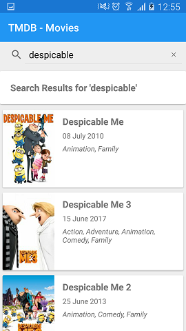
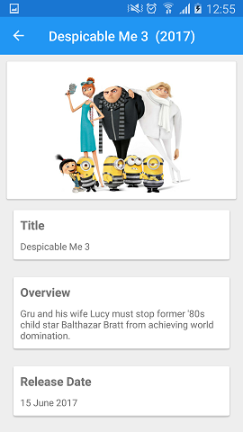

# TMDBXamarin
Xamarin Forms App to show upcoming movies and details of those movies from the TMBD API (https://developers.themoviedb.org/3)

## Third Party Packages

* Prism.Core, Prism.Forms, Prism.Unity.Forms
    * Prism is a framework for building loosely coupled, maintainable, and testable XAML applications in WPF, Windows 10 UWP, and Xamarin Forms. Separate releases are available for each platform and those will be developed on independent timelines. Prism provides an implementation of a collection of design patterns that are helpful in writing well-structured and maintainable XAML applications, including MVVM, dependency injection, commands, EventAggregator, and others. (https://github.com/PrismLibrary/Prism)

* Xaamrin.FFImageLoading, Xamarin.FFImageLoading.Forms
    * Library to load images quickly & easily on Xamarin.iOS, Xamarin.Android, Xamarin.Forms, Xamarin.Mac and Windows (UWP, WinRT) ((https://github.com/luberda-molinet/FFImageLoading)

* Xam.Plugin.Connectivity 
    * Checking to see if app has a working connection to the interent (https://github.com/jamesmontemagno/ConnectivityPlugin)

* Newtonsoft.Json
    * Used for annotation in classes models and deserialization JSON from TMDB API (https://github.com/JamesNK/Newtonsoft.Json)
    
* Unity
    * The Unity Container (Unity) is a lightweight, extensible dependency injection container. It facilitates building loosely coupled applications... (https://github.com/unitycontainer/unity)
    
* NUnit
    * TNUnit is a unit-testing framework for all .Net languages. Initially ported from JUnit, the current production release, version 3, has been completely rewritten with many new features and support for a wide range of .NET platforms (http://nunit.org/)
    
* Xamarin.Forms.Mocks
    * Library for running Xamarin.Forms inside of unit tests (https://github.com/jonathanpeppers/Xamarin.Forms.Mocks/)
    
* CommonServiceLocator
    * The library provides an abstraction over IoC containers and service locators. Using the library allows an application to indirectly access the capabilities without relying on hard references. (https://github.com/unitycontainer/commonservicelocator)

## Screenshots

### Android

